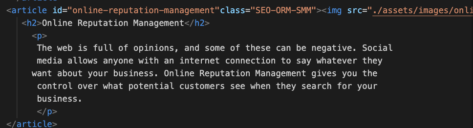
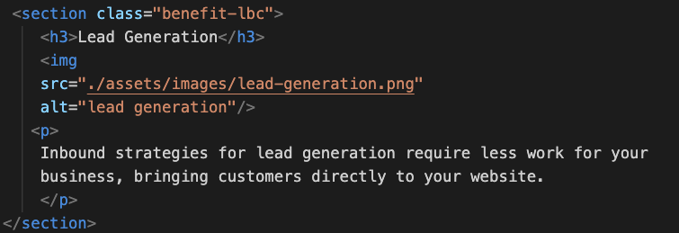
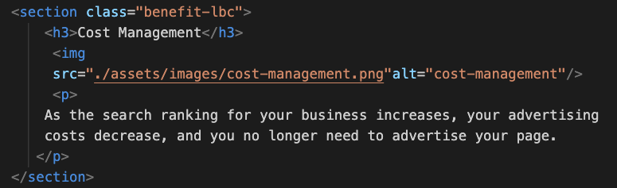

## Name of the project
Code Refactor
## Overview
To refactor an existing site to make it more accessible for the people with disabilities and a codebase that follows accessibility standards.This will have a better User experience and ADA-compliant.
## The Challenge
Refactoring the code for an existing webpage by adding semantic HTML elements and eliminating non-semantic elements like div and span which defines no meaningful content.We need to make this web page more comprehensible by better defining the sections and sequential lay out of the pages.
CSS selectors and properties should be consolidated and organized to follow semantic structure. It should also maintain its current appearance despite any changes that were made to refactor the code.
## User Story
```
AS A marketing agency
I WANT a codebase that follows accessibility standards
SO THAT our own site is optimized for search engines
```
## Acceptance Criteria
```
GIVEN a webpage meets accessibility standards
WHEN I view the source code
THEN I find semantic HTML elements
WHEN I view the structure of the HTML elements
THEN I find that the elements follow a logical structure independent of styling and positioning
WHEN I view the image elements
THEN I find accessible alt attributes
WHEN I view the heading attributes
THEN they fall in sequential order
WHEN I view the title element
THEN I find a concise, descriptive title
```
## Screenshots of HTML Code displays Semantic HTML Element Article & Section logically structured and accessible alt attribute provides alternate text to an image.






## Semantic HTML Elements used and meaning
- nav  
  The element defines a set of navigation links.
- section
  The element defines a section in a webpage.
- article  
  An Element specifies independent, self-contained content.
- alt  
  Specifies an alternate text for an area, if the image cannot be displayed .
- aside  
  Element defines some content aside (Sidebar).
- footer  
  The element defines a footer for a section.

## Links  
[Github URL](https://github.com/ashachakre0906/Code-Refactoring)<br>
[Live URL](https://ashachakre0906.github.io/Code-Refactoring/)<br>
## My process
1. Replaced div tag with Semantic HTML Elements like nav,section,article,alt,aside and footer.
2. Updated the title element and provided more meaningful title to the webpage.
3. Added an missing id attribute to section class="content" which resolved the application's link functioning correctly.
4. Common CSS selectors and properties are consolidated and organized to follow semantic structure.
5. Provided comments to each section in my HTML code wherever changes were made in HTML and CSS both.

## Built with
- Semantic HTML5 markup
- CSS


## What I learned
- In order to implement accessibility standards to this webpage, I needed to learn and understand what HTML semantic elements are. 
- Learned how to consolidate Common CSS selectors and properties to minimize the extra line of code in codebase.
- Learned how to write comments to indicate various changes in HTML and CSS file.
- Learned how to write good README.md file.
```html
<h1>Some HTML code I'm proud of for consolidating Common CSS selectors and properties by creating common class </h1>
```
```CSS
.benefit-lbc {
    margin-bottom: 32px;
    color: #ffffff;
}
```
```CSS
.SEO-ORM-SMM {
    margin-bottom: 20px;
    padding: 50px;
    height: 300px;
    font-family: 'Gill Sans', 'Gill Sans MT', Calibri, 'Trebuchet MS', sans-serif;
    background-color: #0072bb;
    color: #ffffff;
}
```
### Useful resources
- [w3schools](https://w3schools.com) - This helped me understand what semantic elements are.I would really like to refer this going forward for understanding other concepts in HTML and CSS.

## Author
- [@ashachakre](https://www.linkedin.com/in/ashachakre/)

## License
Licensed under the [MIT](https://choosealicense.com/licenses/mit/) license.
MIT License

Copyright (c) [2022] [Asha Chakre]

Permission is hereby granted, free of charge, to any person obtaining a copy
of this software and associated documentation files (the "Software"), to deal
in the Software without restriction, including without limitation the rights
to use, copy, modify, merge, publish, distribute, sublicense, and/or sell
copies of the Software, and to permit persons to whom the Software is
furnished to do so, subject to the following conditions:

The above copyright notice and this permission notice shall be included in all
copies or substantial portions of the Software.

THE SOFTWARE IS PROVIDED "AS IS", WITHOUT WARRANTY OF ANY KIND, EXPRESS OR
IMPLIED, INCLUDING BUT NOT LIMITED TO THE WARRANTIES OF MERCHANTABILITY,
FITNESS FOR A PARTICULAR PURPOSE AND NONINFRINGEMENT. IN NO EVENT SHALL THE
AUTHORS OR COPYRIGHT HOLDERS BE LIABLE FOR ANY CLAIM, DAMAGES OR OTHER
LIABILITY, WHETHER IN AN ACTION OF CONTRACT, TORT OR OTHERWISE, ARISING FROM,
OUT OF OR IN CONNECTION WITH THE SOFTWARE OR THE USE OR OTHER DEALINGS IN THE
SOFTWARE.

